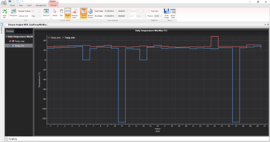
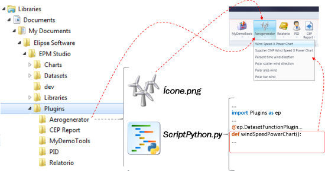
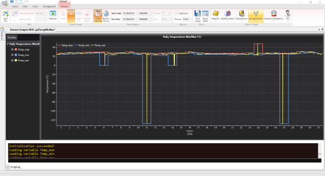
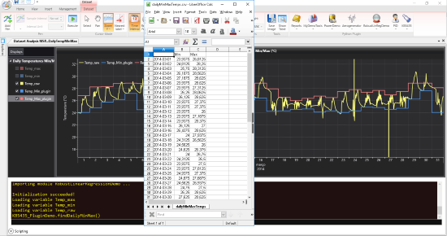

# Agilizando análises no EPM Studio Dataset Analysis (EPM 3) através de plugins

Conteúdo extraído do site [Elipse Knowledgebase](http://kb.elipse.com.br/pt-br/questions/5435/Agilizando+an%C3%A1lises+no+EPM+Studio+Dataset+Analysis+%28EPM+3%29+atrav%C3%A9s+de+plugins.)

## INTRODUÇÃO

Além de apresentar funcionalidades básicas para a realização de diversos tipos de consultas históricas (médias, máximos, mínimos, totalizações, etc.) a dados de processo armazenados em um **EPM Server** e exibir estes resultados em um ambiente gráfico,  a ferramenta **Dataset Analysis** do **EPM Studio** também disponibiliza um ambiente para análises mais complexas através e a sua integração com a [linguagem Python](https://www.python.org/).

Para acessar este ambiente, é necessário expandir a área de *Scripting*; isto abrirá um espaço de trabalho integrado à linguagem Python onde é possível utilizar todos os seus recursos e módulos (bibliotecas).

Este ambiente faz com que o processo de análises via chamada de funções (nativas, proprietárias ou desenvolvidas por terceiros) seja bastante flexível; ainda assim, este processo pode ser agilizado ainda mais através da criação de plugins, que são comandos que aparecem na própria *ribbon* (faixa de opções) do ambiente do **Dataset Analysis**, e que possibilitam ao analista um acesso direto e mais simples às funções implementadas nele.

Para mais detalhes sobre o **Dataset Analysis**, consulte o manual do **EPM** que pode ser obtido diretamente do site da [Elipse Software](https://www.elipse.com.br/downloads/?cat=65&key=&language=ptbr).

## ANÁLISE DE CASO
O exemplo abaixo ilustra como se dá o ganho de agilidade no processo de análise através da criação de plugins.

**Problema:**

O analista precisa identificar todas as temperaturas máximas e mínimas diárias que ocorreram durante o mês de março de 2014.

**Solução:**

Inicialmente foi criado um novo Dataset no **EPM Studio** com a variável que armazena a temperatura em questão. As consultas a serem realizadas sobre esta variável, disponíveis no padrão [OPC UA](https://opcfoundation.org), são: *minimum* e *maximum*. Ambas são realizadas para o período que vai do dia 01/03/2014 (inclusive) até 01/04/2014 (exclusive), com um intervalo de processamento diário.

A figura a seguir apresenta o resultado desta operação:

*Figura 1: Resultado da consulta min/max diárias da temperatura no mês de março/2014*

Este resultado mostra uma situação que é comum na prática: a ocorrência de valores espúrios no conjunto de dados a serem analisados. Averiguando melhor esta questão, constatamos que realmente os instrumentos de medida geraram alguns valores deste tipo nos dias 6, 11, 14, 24 e 27 de março de 2014 - todos estes valores precisam ser removidos do conjunto de dados a ser analisado para se obter os "reais" valores mínimos e máximos dos correspondentes dias.

Como estes valores indesejáveis podem ser removidos para que a análise possa continuar? Existem quatro possibilidades:

1. Refazer a consulta, desta vez buscando os dados brutos (consulta Raw), ou seja, os dados como eles foram efetivamente armazenados. A partir do resultado desta consulta, é possível:
    1. Visualizar os dados no formato tabular do **Dataset Analysis** e, através de uma inspeção visual, identificar e anotar os valores mínimos e máximos de cada dia, desconsiderando aquelas valores tidos com "indesejáveis";
    2. Exportar os dados para um arquivo .CSV e abri-lo em uma ferramenta de planilha eletrônica (Libre Office, MS Excel, etc.), realizando o mesmo processo do item anterior ou implementando uma automatização desta análise nestes ambientes através de scripts/macros/fórmulas.
2. Fazer uma consulta aos dados brutos (consulta Raw) diretamente em uma planilha do MS Excel utilizando o EPM Add-in for Microsoft Excel. Com os dados neste ambiente, prossiga como no item 1.ii.
3. Fazer uma consulta aos dados brutos (consulta Raw) no próprio Dataset Analysis e implementar uma função em linguagem Python para remover os valores indesejáveis e calcular os valores mínimos e máximos diários.
3. Criar um plugin em Python. Esta solução é similar à do item 3, porém, não requer execução manual informando como parâmetro os dados da consulta Raw realizada: **basta selecionar no próprio gráfico a pena (resultado da Consulta) e clicar sobre o comando implementado na forma de plugin**.

Analisando as opções apresentadas, notamos que as duas últimas são as mais simples e flexíveis; a opção 4, particularmente, é a que **atinge o resultado desejado em menor tempo** e com o **menor esforço** dentre as quatro.
Além disso, uma vez que o plugin tenha sido implementado, é possível utilizá-lo outras vezes para análises semelhantes, com outras variáveis ou em outros períodos de tempo.

Para se ter flexibilidade na realização de análises é fundamental que o ambiente de análise disponibilize um vasto conjunto de funcionalidades que viabilizem todo o processo, o que é facilmente obtido através da linguagem Python com pouco esforço, especialmente quando comparada com outras alternativas de mercado.

Além disso, a implementação de um plugin no ambiente **Dataset Analysis** do **EPM Studio** é bastante fácil: para isto, bastam apenas conhecimentos básicos de lógica de programação e de fundamentos da linguagem Python (cuja curva de aprendizado costuma ser relativamente rápida).

A figura abaixo ilustra como fazer um plugin em Python para o **Dataset Analises** do **EPM Studio**.

*Figura 2: Esquema de um plugin em Python para o Dataset Analysis do EPM Studio*

Para desenvolver um plugin em linguagem Python no Dataset Analysis do EPM Studio, siga estes passos:

1. Crie um diretório dentro do diretório "*...\Meus Documentos\Elipse Software\EPM Studio\Datasets\Plugins*" com o nome do plugin a ser mostrado na faixa de opções - no caso da Figura 2, é *Aerogenerator*
2. Coloque dentro deste diretório uma imagem, que será apresentada na faixa de opções - neste caso, o *icone.png*
3. Crie neste mesmo diretório um arquivo texto (ASCII) com a extensão .PY (arquivo de scripts Python) com o código em linguagem Python contendo as funções a serem utilizadas/disponibilizadas pelo plugin.

Depois, basta abrir um **Dataset** no **EPM Studio** e expandir a área scripts em linguagem Python. Além de carregar os módulos (bibliotecas) configurados no arquivo de inicialização deste ambiente, todos os plugins em Python encontrados no diretório Plugins (mencionado anteriormente) serão carregados e apresentados na *ribbon* (faixa de opções) do ambiente **Dataset Analysis** do **EPM Studio**, conforme a figura a seguir:

*Figura 3: Resultado da consulta min/max diárias e Raw no mês de março/2014, já com os plugins Python carregados.*

Na Figura 3, vemos que além das consultas *minimum* e *maximum* diárias, foi adicionada também uma consulta Raw (dados brutos) à mesma variável. Além disso, o ambiente integrado com o Python foi expandido, o que automaticamente carregou todos os plugins disponíveis e os apresentou no grupo *Python Plugins* na ribbon (faixa de opções) do **EPM Studio**.

Feito isso, selecione a pena *TemP_raw* e clique no plugin Python implementado: o resultado será automaticamente calculado e salvo em um arquivo .CSV (*dailyMinMaxTemps.csv*) e também apresentado nas penas *Temp_Min_plugin* e *Temp_Max_plugin* do mesmo gráfico.

A Figura 4 apresenta o resultado final desta operação, bem como o arquivo *dailyMinMaxTemps.csv* aberto no Libre Office.
Note que as penas referentes às consultas [OPC UA](https://opcfoundation.org) da figura anterior foram desmarcadas, deixando visíveis apenas a pena com a consulta Raw e as resultantes da avaliação do plugin.

*Figura 4: Resultado da avaliação do plugin desenvolvido em linguagem Python para o EPM Dataset Analysis*

> :bulb: **NOTAS**
> * Todos os módulos utilizados neste exemplo precisam necessariamente estar disponíveis na versão do Python instalada na própria máquina.
> * O exemplo apresentado neste artigo está baseado na nova API de plugins para o Dataset Analisis do **EPM versão 3**.
> * [Requisitos para um Sistema de Armazenamento e Gerenciamento de Informações. (Elipse Knowledgebase)](http://kb.elipse.com.br/pt-br/questions/5449/Requisitos+para+um+Sistema+de+Armazenamento+e+Gerenciamento+de+Informa%C3%A7%C3%B5es.)
> * Consulte também o webinar de dez/2015 [Agilizando análises no EPM com o poder da linguagem Python](https://www.youtube.com/watch?v=1u9z6YD_2P0), disponível em nosso canal do YouTube. Note que o exemplo apresentado neste vídeo foi desenvolvido com o EPM v.2; no EPM v.3, utilizado neste artigo, os plugins são criados de forma mais simplificada, embora a estrutura conceitual de ambas as versões seja a mesma.
> * [Artigos e Trabalhos Curso que utilizaram este recurso](../Articles/README.md)

## INSTALAÇÃO
Para utilizar o plugin do exemplo:
* criar um diretório com o nome KB5435 (ou qualquer outro nome que se deseje) no seguinte local: C:\Users\ ... \My Documents\ ... \Elipse Software\EPM Studio\Plugins
* copiar os arquivos *KB5435_PluginDemo.py* e *telescope.png* para o diretório recém criado

Ao abrir um *Dataset* e expandir o ambiente integrado com a linguagem Python, todos os *plugins* do diretório *Plugins* do **EPM Studio** serão carregados na *ribbon* - caso não ocorram erros nos códigos dos mesmos durante a operação de avaliação e carregamento.

