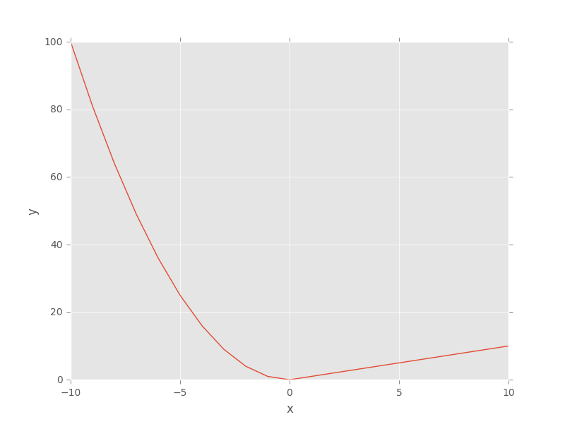
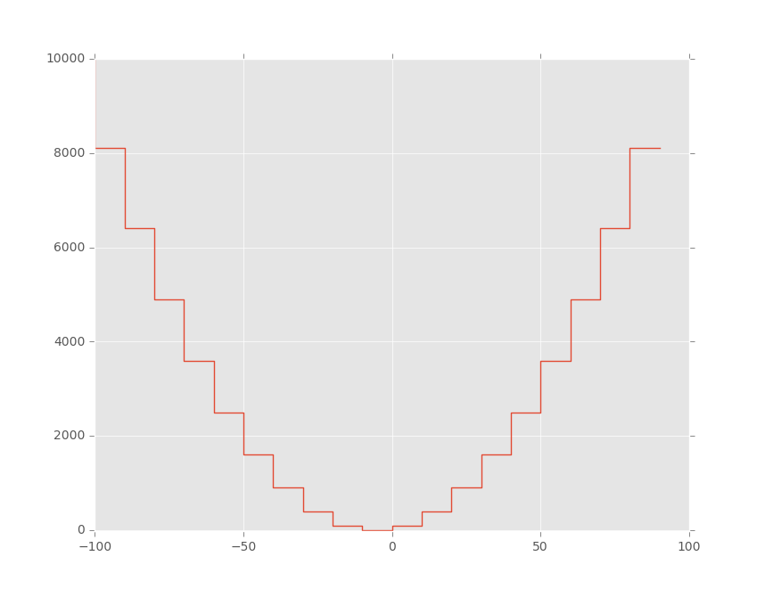

# Breve introdução à linguagem Python 

Este artigo apresenta uma breve introdução à linguagem Python com o objetivo de oferecer uma base mínima de informações para que se possa compreender melhor como utilizar todos os recursos do sitema **EPM** que lançam mão da integração com a linguagem Python.


## O que é a linguagem Python

O Python é uma linguagem de programação de alto nível já consolidada e utilizada em aplicações das mais diversas áreas do conhecimento, muitas delas relacionadas à computação científica, mas também é muito utilizada para desenvolvimentos Web, computação gráfica, jogos, etc., além de ser uma das linguagens mais utilizadas como linguagem de script por programas de computador, assim como para o desenvolvimento de plugins.

Ela foi lançada em 1991 por [Guido van Rossum](https://www.python.org/~guido/Resume.html) e atualmente possui um modelo de desenvolvimento colaborativo e aberto, que é gerenciado pela organização [Python Software Foundation](https://www.python.org/psf), fundada em 2001.
Dentre algumas das suas características, destaca-se o fato de ser uma linguagem multiparadigma, ou seja, tem suporte à programação orientada a objetos, bem como ao estilo de programação funcional, sendo possível desenvolver códigos mesclando os mais diversos estilos de acordo com a conveniência.
Além disso, apresenta uma sintaxe concisa e clara e, como se não bastasse, disponibiliza um conjunto infindável de módulos que conferem a esta linguagem a possibilidade de se desenvolver aplicações complexas e confiáveis com relativamente pouco esforço.


## Conceitos básicos

Tipicamente a linguagem Python é uma linguagem de script e, portanto, interpretada, porém é possível gerar aplicações compiladas a partir dela. Por se tratar de uma linguagem interpretada, a mesma pode ser utilizada em ambientes com suporte a interpretadores interativos, como no caso do **IDLE**, que vem por padrão nas instalações do Python, ou do console Python integrado ao ambiente **Dataset Analysis** do **EPM Studio**, ou mesmo o **Jupyter Notebook**, que possibilita executar blocos de código sob demanda em um ambiente Web, sendo esta uma excelente ferramenta recomendada para análises utilizando as API's do EPM em linguagem Python.

Outra característica importante a ser ressaltada é que, ao contrário de linguagens como C/C++, C#, Java, etc., ela não possui demarcadores de blocos de código, utilizando a própria indentação para tanto, tipicamente 4 espaços em branco. Por isso recomenda-se a utilização de editores de texto com suporte à linguagem Python que identificam problemas com a indentação antes mesmo de se tentar executar o script em questão.

Por fim, para os iniciantes na linguagem Python, é preciso compreender o que são os módulos do Python e como utilizá-los, uma vez que eles são a base onde se sustentam todas as facilidades disponíveis nesta linguagem e que, em muitos casos, são mantidos pela própria comunidade Python, como no caso das API's do EPM em linguagem Python que é mantido pela Elipse Software.
Por hora, basta entender os módulos como bibliotecas que contém um conjunto de funcionalidades e/ou ferramentas que poderão ser utilizadas por analistas e desenvolvedores em Python.

> :bulb:
>
> A linguagem Python é sensível a caixa da letra (*case sensitive*), portanto é importante ficar atento a este fato na criação de variáveis, chamada de funções, criação de objetos, importação de módulos e na utilização das declarações de estruturas de controle de fluxo.


## Tipos de Dados

Além dos tipos de dados básicos **int** (número inteiro), **float** (número de ponto flutuante), **bool** (valor booleano) e **str** (cadeia de caracteres), a linguagem Python tem suporte a outros tipos de dados, dos quais destacam-se **complex** (número complexo), **list** (lista heterogênea), **tuple** (tupla) e **dict** (conjunto associativo, comumente designado por dicionário).

A seguir são apresentados alguns exemplos de uso destes tipos de dados que são amplamente utilizados através dos módulos e para organização, manipulação e persistência das informações ao longo dos códigos e análises. As classes em Python são abordadas em mais detalhes no tópico **Funções e Classes**, e consiste no elemento central da orientação à objetos na linguagem Python.


### Lista

Esta forma de estruturar os dados consiste de um conjunto de valores de qualquer tipo de dados que podem ser referenciados a partir da sua posição na lista.
Os elementos de uma lista são representados entre colchetes e separados por vírgula.
Além das operações de atribuição e edição de valores através de referências às posições, também tem-se à disposição diversos métodos, tais como `append`, `remove`, `pop`, `insert`, etc.

Exemplos:

```python
In [1]: x = [1, 2.5, 'item-3', [7, 8, 9], True]
In [2]: print(x)
[1, 2.5, 'item-3', [7, 8, 9], True, False]
In [3]: print(x[3])
[7, 8, 9]
```


> :bulb:
>
> Estes comandos são executados em um ambiente com um interpretador interativo, onde podem ser inseridos e avaliados comandos, bem como verificar os resultados na sequência.
>
> Esta forma de trabalho já deve ser bastante familiar para quem tem alguma experiência em ferramentas como o **GNU Octave**, **MATLAB** e **Scilab**, dentre outros aplicativos similares.
>
> Para quem não está habituado com este tipo de ambiente, recomenda-se iniciar pelo ambiente interativo **Jupyter Notebook**, devido às suas inúmeras facilidades, principalmente o registro dos comandos executados de maneira clara e organizada.


A primeira linha cria uma lista e a atribui à variável `x`.
A segunda linha executa o comando para imprimir seu conteúdo, enquanto a terceira linha executa o comando apenas para imprimir o conteúdo do item de índice três (quarto item da lista `x`), que corresponde a uma outra lista.

Por fim, a quarta linha adiciona outro item utilizando a função `append` e a quinta linha executa o comando para imprimir novamente na tela o seu conteúdo, agora apresentando o novo item previamente adicionado.

Todos os tipos de dados que representam conjuntos podem referenciar seus elementos através de um índice relacionado à sua posição, iniciando sempre em zero, como nas linguagens de programação C e C++.
A utilização de números negativos como índices na referência de posição indica que a busca deve iniciar a partir do final do conjunto. Desta forma, o índice menos um "[-1]", por exemplo, corresponde ao último elemento de um dado conjunto.

A referência através dos índices das posições também possibilita realizar fatiamentos sobre os dados. Um exemplo é a solicitação dos itens da segunda posição (índice um) até a quinta posição (índice quatro) de um conjunto, que pode ser expressa por "[1:4]".

O comando `print` pode ser utilizado para apresentar o conteúdo de variáveis na saída padrão. No Python versão 2.7 não é necessária a utilização dos parênteses como no Python 3, onde `print` passou a ser uma função ao invés de uma declaração.

> :bulb:
>
> Para mais detalhes sobre as listas, consulte a documentação da linguagem [Python 2.7](https://docs.python.org/2.7).

> :warning:
> O operador de atribuição (sinal de igual), quando utilizado com uma variável que contém uma lista, apenas cria uma referência à esta lista (equivalente a um ponteiro em C/C++).
>
> Caso a intenção seja criar uma cópia da lista, é necessário usar explicitamente o método `copy`.
>
> Exemplo:
>    ```python
>    In [1]: x = [1, 2.5, 'item-3', [7, 8, 9], True]
>    In [2]: y = x
>    In [3]: y[2] = 'item-99'
>    In [4]: print(x)
>    [1, 2.5, 'item-99', [7, 8, 9], True, False]
>    In [5]: z = x.copy()
>    In [6]: z[2] = 'item-11'
>    In [7]: print(x)
>    [1, 2.5, 'item-99', [7, 8, 9], True, False]
>    In [8]: print(z)
>    [1, 2.5, 'item-11', [7, 8, 9], True, False]
>    ```


### Tupla

Este tipo de estrutura de dados guarda dois ou mais valores separados por vírgulas.
Ao contrário das listas, as tuplas são imutáveis, portanto são recomendadas para armazenar tipos de dados distintos, enquanto que as listas são geralmente utilizadas para armazenamento de tipos de dados homogêneos.

Outro aspecto relacionado a imutabilidade das tuplas em relação à mutabilidade das listas é o melhor desempenho computacional ao acesso das informações dispostas na primeira estrutura, uma vez que parte do pressuposto da imutabilidade para se atingir este efeito.

Apesar de não ser necessário, é usual representar as tuplas entre parênteses, deixando o código mais legível e facilitando a identificação deste tipo de estrutura de dados no meio do código, diferenciando-se das listas que utilizam os colchetes.

Exemplos:
```python
In [1]: x = (1, 2.5, 'item-3', [7, 8, 9], True)
In [2]: print(x)
(1, 2.5, 'item-3', [7, 8, 9], True)
In [3]: print(x[3])
[7, 8, 9]
In [4]: x[3] = [9, 8, 7]
----------------------------------------------------------
TypeError   Traceback (most recent call last)
<ipython-input-5-aacebe3f8394> in <module>()
----> 1 x[3] = [9, 8, 7]
TypeError: 'tuple' object does not support item assignment
```

A primeira linha cria uma tupla com cinco elementos e a armazena na variável `x`, enquanto a segunda linha imprime na tela o seu conteúdo. De forma análoga, foi apresentado o quarto elemento da tupla, que é uma lista.

Por fim, a quarta linha tenta atribuir uma nova lista à quarta posição, o que retorna uma mensagem de erro informando não se tratar de uma operação válida. Este erro já era esperado, uma vez que as tuplas não permitem a alteração de seus elementos, sendo esta outra diferença deste tipo de dados para as listas, onde esta operação de atribuição de valor é válida.


### Dicionário

Este tipo de estrutura de dados consiste de um conjunto associativo, comumente chamado de dicionário, no qual as informações são armazenadas em uma estrutura do tipo chave-valor.
Os elementos do conjunto são separados por vírgulas e, neste caso, os índices devem ser informados juntamente com os respectivos valores separados por dois pontos. Neste caso, os índices também costumam ser chamados de chave, uma vez que esta informação é utilizada para se acessar o conteúdo relacionado à chave.

Exemplos:

```python
In [1]: x = {'ex_int':1, 'ex_float':2.5, 'ex_str':'item-3', 'ex_list':[7, 8, 9], 'ex_bool':True}
In [2]: print(x)
{'ex_list':[7, 8, 9], 'ex_int':1, 'ex_float':2.5, 'ex_str':'item-3', 'ex_bool':True}
In [3]: print(x['ex_list'])
[7, 8, 9]
In [4]: x['ex_list2'] = [9, 8, 7]
In [5]: print(x)
{'ex_bool':True, 'ex_int':1, 'ex_list':[7, 8, 9], 'ex_list2':[9, 8, 7], 'ex_float':2.5, 'ex_str':'item-3'}
```


A primeira linha cria um dicionário com cinco elementos e o armazena na variável `x`, enquanto a segunda linha imprime na tela o seu conteúdo.

A terceira linha imprime na tela apenas o conteúdo referente à chave `ex_list` do dicionário, enquanto a quarta linha adiciona mais um elemento ao dicionário referenciado a uma nova chave, `ex_list2`.

Por fim, a última linha imprime novamente o conteúdo da variável `x` na tela, onde é possível constatar o novo elemento que foi adicionado ao dicionário no passo anterior.

> :bulb:
>
> Os índices (chaves) não precisam necessariamente ser **Strings**, também é possível utilizar tuplas, bem como utilizar ambos simultaneamente como índices.
> Vale ressaltar esta outra característica de estruturas de dados imutáveis, a qual possibilita a sua utilização como índice (chave) para a referência a valores em estruturas associativas como em um dicionário.


> :warning:
>
> O operador de atribuição (sinal de igual), quando utilizado com uma variável que contém um dicionário, apenas cria uma referência (equivalente a um ponteiro em C/C++) a este dicionário.
> Caso a intenção seja criar uma cópia do dicionário, é necessário usar explicitamente o seu método `copy`.
>
> Exemplo:
>    ```python
>   In [1]: x = {'ex_int':1, 'ex_float':2.5, 'ex_str':'item-3', 'ex_list':[7, 8, 9], 'ex_bool':True}
>   In [2]: y = x
>   In [3]: y['ex_str'] = 'item-99'
>   In [4]: print(x)
>   {'ex_list':[7, 8, 9], 'ex_int':1, 'ex_float':2.5, 'ex_str':'item-99', 'ex_bool':True}
>   In [5]: z = x.copy()
>   In [6]: z['ex_str'] = 'item-11'
>   In [7]: print(x)
>   {'ex_list':[7, 8, 9], 'ex_int':1, 'ex_float':2.5, 'ex_str':'item-99', 'ex_bool':True}
>   In [8]: print(z)
>   {'ex_list':[7, 8, 9], 'ex_int':1, 'ex_float':2.5, 'ex_str':'item-11', 'ex_bool':True}
>    ```


## Estruturas de Controle de Fluxo

A seguir são apresentados os comandos das principais estruturas para controle de fluxo no Python. A parte relativa ao tratamento de exceções é abordada no tópico **Tratamento de Exceções**.

Todas as estruturas de controle seguem a mesma lógica de indentação para agrupamento dos blocos de código, além, é claro, de manter a filosofia básica de simplicidade e clareza.


### Declarações If, Elif e Else

A declaração `if` é utilizada para definir se um comando ou sequência de instruções deve ou não ser executado, dada uma condição.

Como todas as estruturas de controle de fluxo em Python, logo após a declaração `if` e a condição a ser avaliada, deve ser utilizado os dois pontos, enquanto a sequência de instruções deve seguir a indentação utilizada em todo o código.

Exemplos:

```python
In [1]: A, B = (81, 91)
In [2]: if A > B:
  ....:  print('A > B')
  ....: elif A < B:
  ....:  print('A < B')
  ....: else:
  ....:  print('A == B')
  ....:
A < B
```
A primeira linha atribui os valores da tupla (81, 91) às variáveis `A` e `B`.
A segunda linha realiza a comparação destas duas variáveis e solicita que o texto `"A > B"` seja impresso na saída caso o resultado desta avaliação seja verdadeiro.
A linha seguinte adiciona uma nova condição a ser avaliada através da declaração `elif`, imprimindo o resultado `"A < B"` na tela caso a avaliação retorne um valor verdadeiro.

Por fim, as duas linhas seguintes mostram a declaração else e a instrução para apresentar na tela o resultado `"A == B"` caso nenhuma das avaliações anteriores tenha retornado um valor verdadeiro.

Observe que na linguagem Python não é necessário a utilização de marcadores de final de bloco de código, os quais são identificados segundo o seu nível na indentação do código, deixando-o mais claro e legível.

A declaração `elif` é utilizada para adicionar uma ou mais condições após uma primeira condição `if` ser declarada. Observe que a sua indentação deve corresponder à do `if` ao qual se refere, bem como não esqueça os dois pontos após a condição a ser avaliada.

As declarações `elif` e `else` não são obrigatórias. A primeira pode ser declarada mais de uma vez em um bloco condicional, enquanto a segunda pode ser declarada apenas uma vez. A sequência de instruções de um bloco `else` é executada toda vez que as condições anteriores não tenham sido satisfeitas.

É comum nos ambientes com interpretadores interativos que executam a sequência de instruções assim que a tecla **ENTER** é pressionada, quando identificam uma instrução ainda não concluída, como no caso de uma declaração de controle de fluxo, criam uma nova linha já com a indentação correta para que possam ser adicionadas as instruções restantes.
Muitos destes ambientes denotam estas linhas adicionais utilizando quatro pontos finais seguidos do caractere de dois pontos.

Os operadores de comparação são `<` (menor que), `>` (maior que), `<=` (menor ou igual a), `>=` (maior ou igual a), `!=` (diferente de), `<>` (diferente de), `==` (igual a), `not` (não), `and` (e) e `or` (ou).

Os operadores de pertencimento são `in` (pertence a) e `not in` (não pertence a).
Os operadores de identidade são `is` (é) e `is not` (não é).


### Declaração While

A declaração `while` é utilizada para avaliar uma sequência de instruções repetidamente enquanto uma dada condição seja verdadeira ou se depare com a declaração break.

Além da declaração **break**, outra declaração útil que pode ser utilizada em conjunto com **while** para controlar o fluxo de avaliação das sequências de instruções é a declaração **continue**, que promove a interrupção da avaliação da sequência de instruções no ponto onde foi declarada, retornando ao início do laço onde novamente é verificada a condição de execução da sequência de instruções.

Suponha que se queira gerar uma lista com valores que seguem a lógica descrita na figura a seguir.

```
       | x**2  ->  se x <= 0
f(x) = |
       | x     ->  se x == 0
```
O gráfico da função anterior é apresentado na figura a seguir.


O código utilizado para implementar a lógica anterior é o seguinte:

```python
In [1]: x = range(-10, 11)
In [2]: y = []
In [3]: i = -1
In [4]: while True:
  ....:  i += 1
  ....:  if i > len(x) - 1:
  ....:    break
  ....:  if x[i] > 0:
  ....:    y.append(x[i])
  ....:    continue
  ....:    y.append(x[i] ** 2)
  ....:
In [5]: j = -1
In [6]: while j < len(x) - 1:
  ....:  j += 1
  ....:  print('x: {0}  -  y: {1}'.format(x[j], y[j]))
  ....:
x: -10  -  y: 100
x: -9  -  y: 81
x: -8  -  y: 64
x: -7  -  y: 49
x: -6  -  y: 36
x: -5  -  y: 25
x: -4  -  y: 16
x: -3  -  y: 9
x: -2  -  y: 4
x: -1  -  y: 1
x: 0  -  y: 0
x: 1  -  y: 1
x: 2  -  y: 2
x: 3  -  y: 3
x: 4  -  y: 4
x: 5  -  y: 5
x: 6  -  y: 6
x: 7  -  y: 7
x: 8  -  y: 8
x: 9  -  y: 9
x: 10  -  y: 10
```

A primeira linha cria uma lista de números inteiros de -10 a 10, através do comando `range`, e atribui o resultado à variável `x`. As duas linhas seguintes criam uma lista vazia para `y` e atribuem o valor -1 (menos um) para a variável `i`, que é utilizada para referenciar os elementos de `x`.

A quarta linha inicia o bloco de comando `while` e, como a sua cláusula é sempre verdadeira (`true`), é preciso utilizar outro mecanismo de interrupção do laço, que neste caso é realizado pela declaração `break` quando a variável `i`, que é incrementada a cada iteração, é maior que o número de elementos da lista `x` (obtido pela função len) menos uma unidade.

Para demonstrar o funcionamento da declaração continue, adicionou-se uma verificação do valor do elemento da lista `x` que está sendo avaliado naquele momento. Caso seja maior que zero, este valor é adicionado à lista `y` e retorna ao início do laço por conta da declaração `continue`, permitindo que a linha seguinte, que adiciona o valor do elemento de `x` elevado ao quadrado à lista `y`, não seja avaliada.

Após o bloco do primeiro while que cria a lista `y` segundo a regra previamente definida, realiza-se um novo laço `while`, agora com a condição de saída presente na própria cláusula. O objetivo deste `while` é iterar elemento a elemento das listas `x` e `y` e apresentá-los na saída padrão através da função `print` utilizando o recurso de formatação de **Strings** e substituição de índices (chaves) pelos respectivos valores, como pode ser deduzido do próprio código.

> :bulb:
>
> Vale ressaltar que existem maneiras mais eficientes e elegantes de resolver o problema deste exemplo, porém o objetivo aqui é apenas ilustrar o funcionamento da declaração `while` e das demais declarações.


### Declaração For e In

A declaração `for` é utilizada para avaliar uma sequência de instruções repetidamente enquanto itera por algum conjunto definido logo após a declaração `in`. É possível interromper o laço a qualquer momento através de uma declaração `break`.

A sua utilização difere um pouco de linguagens como C/C++, onde são explicitamente declarados o início, o passo de iteração e o fim do laço. Em Python, a declaração `for` opera diretamente sobre os elementos de um conjunto definido na declaração `in`.

Assim, para imprimir os valores de zero a cinco na saída padrão, deve-se antes criar uma lista com estes valores e iterar sobre esta lista. Isto pode ser realizado utilizando a função range, como no exemplo a seguir.

```python
In [1]: for i in range(6):
  ....:  print(i)
  ....:
0
1
2
3
4
5
```

Suponha que se queira gerar uma lista com o quadrado dos valores do intervalo entre -100 e 100, com um passo regular de 10 unidades, resultando no gráfico com uma aparência parabólica conforme a imagem a seguir.


O código utilizado para implementar a lógica anterior (similar à implementação da declarações `while`) é o seguinte:

```python
In [1]: x = range(-100, 100, 10)
In [2]: y = [i ** 2 for i in x]
In [3]: print((x[0:-1:5], y[0:-1:5]))
([-100, -50, 0, 50], [10000, 2500, 0, 2500])
```

A primeira linha usa a função range para criar uma lista de valores inteiros entre -100 e 100 com um intervalo regular de 10 unidades, atribuindo o resultado à variável `x`.
A função `range` pode receber até três argumentos, o valor inicial, o valor final e o passo a ser utilizado para gerar a lista. Esta função costuma ser muito utilizada em conjunto com as declarações `for` e `in` justamente para auxiliar no controle das iterações.

A linha seguinte utiliza um dos muitos recursos do Python para a criação de uma lista com o resultado da avaliação dos elementos da variável `x`, elevando ao quadrado elemento a elemento. O resultado é atribuído à variável `y`.

A última linha imprime na tela apenas os pares `(x, y)` correspondentes aos elementos das posições inicial (0), final (-1) e todos os múltiplos de cinco (passo utilizado no fatiamento do vetor).
Este é outro recurso muito utilizado para operar sobre sub-conjuntos específicos de dados de objetos que contém outros elementos, como no caso das listas.

> :bulb:
>
> Vale ressaltar que o resultado impresso na tela do exemplo anterior corresponde a uma tupla cuja primeira posição contém alguns dos elementos da lista `x` ([primeiro, múltiplos de 5, último]), enquanto na segunda posição encontram-se alguns dos elementos correspondentes da lista `y` (quadrado dos valores correspondentes em `x`).


## Funções
Uma função em Python pode ser compreendida como um conjunto de instruções organizadas e agrupadas de maneira tal que é possível a sua reutilização em diversos locais, seja através de chamadas diretas a partir de um ambiente com um interpretador interativo, seja de dentro de códigos de aplicações mais complexas ou de maneira recursiva, ou seja, uma função chamando a si mesma recursivamente até concluir seu processamento.

A seguir são listados alguns aspectos importantes a serem observados em relação às funções em Python.
As definições de uma função sempre iniciam com a declaração `def` e tem o formato a seguir.

Exemplo:
```python
def function_name([parameters...]):
  # code...
```


Assim, logo após uma declaração `def` deve vir o nome da função seguido de parênteses e dois pontos. A passagem de parâmetros à função é opcional.

> :bulb:
>
> O nome de uma função é sempre único em um dado escopo, uma vez que é necessário identificar univocamente o conjunto de instruções às quais a função se refere.

Todo o conjunto de instruções pertinentes à uma função deve respeitar sua indentação, ou seja, todas as linhas de código a partir da declaração inicial da função (`def`) devem estar indentadas com o espaçamento escolhido (em geral quatro espaços).

Uma função também pode retornar um ou mais valores ao final do seu processamento. Para tanto, é necessário utilizar a declaração `return` no interior da própria função seguido dos valores que se deseja retornar.

Exemplo:
```python
def function_name():
  # code...
  return -1, 0, 1
```

No caso anterior, uma chamada a esta função retorna sempre três valores, -1 (menos um), 0 (zero) e 1 (um).

> :bulb:
>
> É possível declarar toda uma função em apenas uma linha, ou seja, as instruções seguem logo após os dois pontos da declaração da função, como por exemplo `def quadVal(x): return x**2`.
> Neste exemplo é declarada a função `quadVal`, que recebe um argumento e retorna o seu valor elevado ao quadrado.

O primeiro bloco de texto localizado na linha imediatamente abaixo da declaração de uma função é automaticamente interpretado pelo Python como um texto informativo sobre a função, sendo usualmente utilizado para orientar como a função pode ser utilizada (texto de ajuda da função).
Este bloco de texto é usualmente designado por **docstring**.

Exemplo:
```python
def function_name():
  """
  Esta função não faz nada!
  Digitando em um ambiente com interpretador integrado:
  help(function_name)
  obtém-se como resultado este mesmo texto.
  """
  pass
```

No caso do exemplo anterior, as três aspas duplas são utilizadas para identificar um bloco de texto na linguagem Python.
O uso deste recurso é comum na documentação de funções, apresentando o seu conteúdo toda vez que o comando `help` é executado em um ambiente com um interpretador interativo, informando como argumento o nome da função.


A declaração `pass` no código anterior não tem efeito, porém é por vezes utilizada para indicar pontos que precisam ser implementados posteriormente, uma vez que é simplesmente ignorada.

É importante observar que o código de exemplo anterior apresenta erros de sintaxe caso seja digitado diretamente em um ambiente com um interpretador interativo que não tenha suporte a caracteres **Unicode (UTF-8)**, uma vez que utiliza caracteres especiais.

Para carregar módulos no Python 2.7 sem apresentar erros de sintaxe, os arquivos com os códigos que utilizam caracteres especiais devem ser criados em editores com suporte a Unicode, ou utilizar explicitamente a declaração `# -*- coding: utf-8 -*-` no início do arquivo .py.

Os argumentos de uma função em Python são dicionários, sendo assim é possível realizar chamadas a uma função passando argumentos fora da ordem correspondente à sua declaração, desde que se utilize o formato chave-valor.

Exemplo:
```python
def function_name(a, b, c, d = 11, e = 12):
  """
  Esta função retorna a avalição da seguinte expressão:
  res = a ** 2 + b * c + d + e
  os parâmetros "d" e "e" da função possuem um valor padrão, não sendo necessário informá-los caso se deseje utilizar os valores 11 e 12 respectivamente.
  
  Exemplo de chamada da funçãoinformando os parâmetros na ordem da sua declaração:
  >>> res1 = function_name(5, 6, 7)
  
  Exemplo de chamada da função com os mesmos parâmetros, porém não na ordem da sua declaração:
  >>> res2 = function_name(b = 6, c = 7, a = 5)
  
  Neste caso, os valores das variáveis "res1" e "res2" devem ser iguais.
  """
  return (a ** 2 + b * c + d + e)
```

Uma função também pode operar com um número de argumentos não definidos na sua declaração.
Isto é realizado através dos caracteres `*` e `**` colocados antes da variável que recebe uma lista dos parâmetros e uma lista de parâmetros do tipo chave-valor, respectivamente.

Exemplo:
```python
def test(a, *args, **kwargs):
  print(a)
  for arg in args:
    print(arg)
  if kwargs is not None:
    for key, value in kwargs.iteritems():
      print('Key: {}  - Value: {}'.format(key,value))
```

Executando a função **test** em um ambiente com um interpretador interativo:
```python
>>> test('qwe', 'rty', 'uio', b=2, c=3, d=4)
qwe
rty
uio
Key: c  - Value: 3
Key: b  - Value: 2
Key: d  - Value: 4
```


Em Python também é possível declarar uma função indefinida, ou seja, que não tem nome. Em geral é utilizada quando se precisa realizar um pequeno processamento sobre valores de conjuntos de dados. Para a sua criação, utiliza-se a declaração `lambda`.

Para demonstrar a utilização da função `lambda`, vamos apresentar uma outra forma de resolver o problema do exemplo apresentado anteriormente para gerar uma lista com o quadrado dos valores no intervalo entre -100 e 100, com intervalo regular de 10 unidades.

```python
# idem exemplo anterior
In [1]: x = range(-100, 100, 10)
# equivalente à linha: y = [i ** 2 for i in x]
# do exemplo anterior
In [2]: y = map(lambda v: v ** 2, x)
# idem exemplo anterior
In [3]: print((x[0:-1:5], y[0:-1:5]))
([-100, -50, 0, 50], [10000, 2500, 0, 2500])
```

A primeira linha cria uma lista da mesma maneira que no exemplo apresentado anteriormente, e atribui a lista à variável `x`.
A linha seguinte utiliza as funções `map` e `lambda` (ambas nativas do Python), a primeira permite que todos os elementos da lista `x` sejam avaliados pela função `lambda`, que é passada como primeiro argumento da função `map`.

A função `lambda` é bastante simples, logo após a sua declaração deve vir uma lista dos parâmetros seguida por dois pontos, e então as instruções do processamento em si, que neste caso é simplesmente elevar ao quadrado o valor do parâmetro.

> :bulb:
>
> Além das funções `map` e `lambda`, outras duas funções do Python são bastante úteis quando se opera com conjuntos de dados e funções, `reduce` e `filter`.
> Ambas são utilizadas de maneira análoga à função `map`. A primeira aplica uma função sobre um conjunto de dados reduzindo o resultado a um escalar, enquanto a segunda aplica um filtro definido na função que é passada como argumento sobre o conjunto de dados também passado como argumento.

Agora que está definido o que é e como funciona uma função em Python, é possível dizer que, na verdade, uma função em Python nada mais é do que mais um tipo de objeto Python, ou seja, este objeto pode inclusive ser atribuído a uma variável.
Mais detalhes sobre objetos e as classes que os definem são apresentados no tópico a seguir, por hora é apenas apresentado um exemplo deste comportamento mencionado.

```python
In [1]: def sum2args(a, b): return a + b
In [2]: print(sum2args(3, 5))
8
In [3]: c = sum2args
In [4]: print(type(c))
<type 'function'>
In [5]: print(c(3, 5))
8
```

A primeira linha define a função `sum2args`, que retorna a soma de dois argumentos passados como parâmetro da função.
A segunda linha imprime na saída padrão o resultado da chamada desta função passando os valores `3` e `5`.
A terceira linha atribui a função à variável `c`, imprimindo o tipo da variável `c` na linha seguinte, onde pode-se observar que é do tipo `function`.

Por fim, a última linha imprime novamente na saída padrão a mesma chamada da função anterior, porém agora utilizando a variável c ao invés do próprio nome utilizado na declaração da função. Neste caso é possível redefinir a função `sum2args` alterando seus parâmetros ou processamento sem que seja alterada a função originalmente definida e que foi atribuída à variável `c`.


## Classes
As classes em Python contém todas as funcionalidades básicas definidas no paradigma de programação orientada a objetos, assemelhando-se muito com a linguagem C++, porém com muito menos código (sintaxe e semântica) se consegue definir uma classe em Python.

De maneira análoga às funções apresentadas no tópico anterior, as classes têm uma declaração padrão que as definem e todo seu conteúdo deve estar em um bloco de indentação. A sua sintaxe é a seguinte:

```python
class Class_name:
  """
  Informações sobre a classe
  """

  def __init__(self, arg1, arg2):
    self.arg1 = arg1
    self.arg2 = arg2
    def sumArgs(self):
      return self.arg1 + self.arg2
```

Logo após os dois pontos da declaração da classe pode-se utilizar o **docstring** para ser utilizado como texto de ajuda e em seguida as definições da classe.

Todas as funções membros de uma classe são definidas de maneira análoga às funções em Python, ou seja, utilizando a declaração `def`. Quando é necessário manipular seus membros, deve-se informar como primeiro argumento a declaração `self`, que pode ser compreendido como um ponteiro para a própria classe (como a palavra-chave **this** do C++).

No exemplo anterior a classe foi definida com dois membros que recebem os valores `arg1` e `arg2`, que devem ser informados na função construtora da classe.
Na definição de uma classe não é necessário declarar a função construtora, que é sempre criada por padrão, porém é possível redefini-la. Isto é obtido através da redefinição da função `__init__` (dois sublinhados antes e dois sublinhados após a palavra **init**), como no exemplo anterior.

A função `__init__`, assim como outras que não são abordadas neste artigo, fazem parte de um conjunto de funções que toda classe em Python tem, sendo possível sobrescrevê-las para se obter o comportamento desejado.

O código a seguir cria um objeto da classe apresentada anteriormente em um ambiente com um interpretador interativo, executando-se na sequência o seu método `sumArgs`.

```python
In [1]: x = Class_name(2, 3)
In [2]: print(x.sumArgs())
5
```

A primeira linha cria um objeto definido pela classe `Class_name` e o atribui à variável `x`.
A segunda linha imprime na saída padrão o resultado da avaliação do método `sumArgs` definido pela classe `Class_name`.

Mais informações sobre a utilização de classes em Python podem ser obtidas na documentação fornecida pela [Python Software Foundation](https://www.python.org/psf) ou através de inúmeros materiais disponíveis na Internet.


## Módulos ou Frameworks em Python
Os módulos em Python podem ser compreendidos como bibliotecas onde é possível organizar todo o código desenvolvido, agrupando-o em um conjunto lógico para fácil entendimento, manutenção e utilização, inclusive por terceiros.

Para utilizar um módulo em Python é preciso que este esteja disponível no escopo que se pretende trabalhar, ou seja, em um ambiente com um interpretador interativo, em outro código de um script ou mesmo outro módulo.
Para isto, utilize a declaração `import`. A seguir são apresentadas algumas das formas de utilização desta declaração.

```python
In [1]: import module1
In [2]: x = module1.func1()
```

Neste exemplo a primeira linha importa o módulo hipotético **module1** para o ambiente com um interpretador integrado e a segunda linha atribui à variável `x` o resultado da avaliação da função `func1`, também hipotética, do módulo **module1**.

Note que neste caso é preciso sempre especificar a qual módulo pertence a função, ou seja, definir a qual escopo pertence. Isto é realizado através da utilização do ponto entre o nome do módulo e da sua função.
Esta é a forma do Python identificar o mapeamento correto de nomes para os respectivos objetos (**namespace**).

No exemplo a seguir é criado um apelido (alias) para o módulo, facilitando a sua posterior utilização.

```python
In [1]: import module1 as md1
In [2]: x = md1.func1()
```

Neste caso é utilizado um apelido (alias) previamente definido para o **module1**, de maneira que a chamada da função `func1` é reduzida.

Esta é a forma recomendada para a utilização dos módulos em Python, facilitando a todos que têm acesso ao código compreender a qual escopo uma dada função pertence, evitando-se eventuais ambiguidades.

No caso de módulos que contém sub-módulos, para a sua utilização é preciso informá-lo na declaração `import` de maneira análoga, como no caso do sub-módulo `pyplot` do módulo `matplotlib`, por exemplo. Neste caso, utilizando-se a notação anterior, a importação do módulo `pyplot` é a seguinte:

```python
In [1]: import matplotlib.pyplot as plt
In [2]: fig = plt.figure()
```

A primeira linha importa apenas o sub-módulo `pyplot` pertencente ao módulo `matplotlib`, atribuindo-lhe o apelido `plt`.
A linha seguinte cria uma figura para posterior utilização em gráficos, atribuindo-a à variável `fig`.

> :bulb:
>
> Assim como neste caso utilizou-se o apelido `plt` para designar o módulo `matplotlib.pyplot`, apelidos para outros módulos comumente utilizados pela comunidade Python já foram consagrados, recomendando-se a sua utilização para facilitar a leitura dos códigos por terceiros.
>
> A exemplo destes apelidos, cita-se `np` para o módulo **Numpy** e `pd` para o módulo **Pandas**.

Uma outra forma de carregar os módulos no ambiente de trabalho é através da importação de todo o seu conteúdo utilizando o caractere de asterisco, porém não se recomenda a utilização deste formato pelos motivos já mencionados anteriormente em relação à identificação dos escopos das funções dos módulos e eventuais problemas de ambiguidades de nomes.

Sobre os módulos em Python é importante ainda ressaltar que alguns são nativos do próprio Python, como o `datetime` por exemplo, para trabalhar com dados no formato de data e hora, enquanto outros são desenvolvidos por terceiros, lembrando que a comunidade Python é realmente grande e ativa, e vem crescendo cada vez mais nos últimos anos.

Por conta deste grande volume de módulos desenvolvidos por terceiros, foram criados inúmeros mecanismos para a distribuição destes módulos.
A forma mais recente e recomendada, quando disponível, é através do comando `pip install nome_do_módulo` a ser executado em um *prompt* de comando do Windows (*cmd*).

No caso de não se dispor de conexão com a Internet, é preciso baixar manualmente o módulo que se deseja instalar e executar o comando anterior, mas informando o nome do arquivo baixado ao invés de apenas o nome do módulo.

Mais informações sobre a utilização, criação e instalação de módulos no Python podem ser obtidas na documentação fornecida pela [Python Software Foundation](https://www.python.org/psf) ou através de inúmeros materiais disponíveis na Internet.

> :bulb:
>
> Os arquivos dos módulos Python para serem instalados via **pip** tem a extensão **.whl**.
> Versões para Windows podem ser encontradas no website [Unofficial Windows Binaries for Python Extension Packages](http://www.lfd.uci.edu/~gohlke/pythonlibs).


## Tratamento de Exceções

A linguagem Python provê um mecanismo de tratamento de exceções que possibilita definir as ações que devem ser tomadas quando ocorrerem problemas durante a execução de um código sintaticamente correto.

As declarações utilizadas para lidar com exceções são `try`, `except`, `else` e `finally`.

Para lidar com as exceções é possível utilizar a classe básica `Exception` definida nativamente na linguagem Python.
A partir desta classe é possível derivar outras para tratamentos de exceções de casos particulares que venham a ser necessários.
A sintaxe para lidar com as exceções é a seguinte:

```python
try:
  # bloco de código principal a ser executado
except(Exception1[, Exception2[,...Exception_n]]]):
  # bloco de código para o tratamento das exceções
  # dos tipos definidos como parâmetros
  # da declaração
else:
  # bloco de código a ser executado
  # caso nenhuma exceção tenha sido detectada
finally:
  # bloco de código a ser sempre executado
```

Além de tratar exceções, também é possível criar um evento de exceção através da declaração `raise`, seguida ou não de argumentos a serem utilizados no tratamento da exceção lançada.

> :bulb:
>
> É possível definir formas distintas de tratar diferentes tipos de exceções que venham a ocorrer no código.
> Neste caso é preciso explicitamente declarar o tipo de exceção a tratar por uma das cláusulas `except`.

O exemplo a seguir declara uma classe que herda as suas definições da classe base `Exception` do Python e depois a utiliza para o tratamento de uma exceção relacionada.

```python
In [1]: class MyException(Exception):
  ....:  def __init__(self, info):
  ....:    self.info = info
In [2]: try:
  ....:  raise MyException('Some error!')
  ....: except MyException as ex:
  ....:  print('Exception raised. Information: {}'.format(ex.info))
  ....: else:
  ....:  print('Never will be!')
  ....: finally:
  ....:  print('Always will be!')
  ....:
Exception raised. Information: Some error!
Always will be!
```

A primeira linha define a classe `MyException` a partir da classe base `Exception` do Python, que contém um membro `info` para armazenar informações que podem ser passadas no momento do lançamento de uma exceção.

A segunda linha inicia o bloco de tratamento de exceções com a declaração `try`.
O código deste bloco sempre vai lançar uma exceção do tipo `MyException`, que é capturada na sequência pela declaração `except`, imprimindo seu conteúdo.

A declaração `else` foi colocada apenas para demonstrar o seu funcionamento, que neste caso nunca é avaliada, uma vez que no bloco `try` uma exceção é sempre disparada.

Por fim, a declaração `finally` foi adicionada para demonstrar que sempre é avaliada, independente de ter sido ou não disparada uma exceção.

Mais informações sobre o tratamento de exceções em Python podem ser obtidas na documentação fornecida pela [Python Software Foundation](https://www.python.org/psf) ou através de inúmeros materiais disponíveis na Internet.

