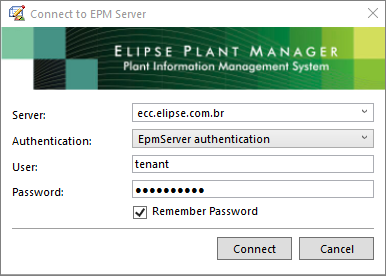
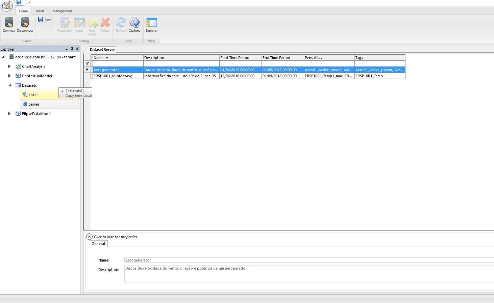
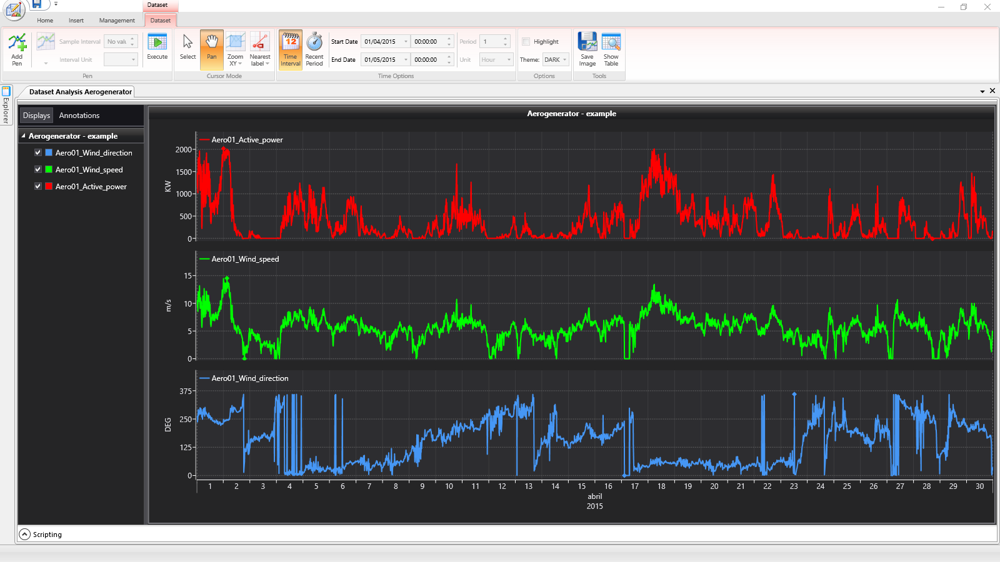
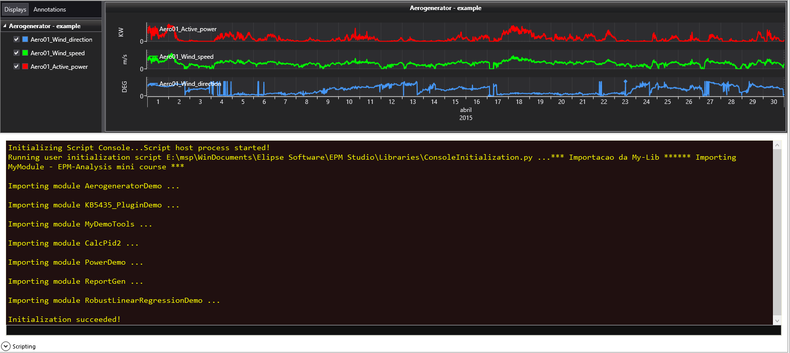
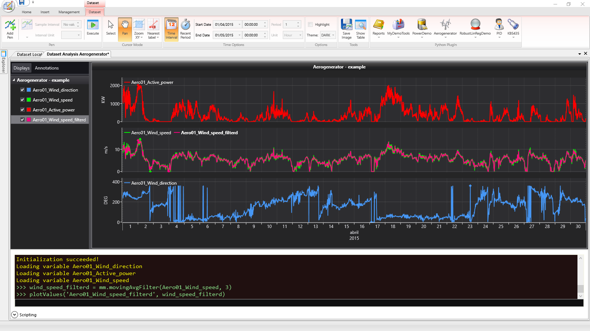
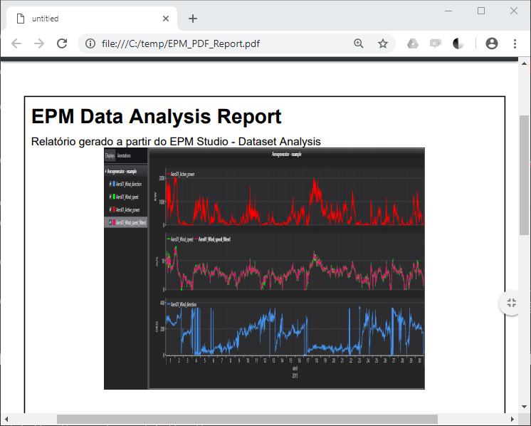

# EPM Studio - Dataset Analysis - Módulos Python 

O conteúdo deste exemplo está relacionado às funcionalidades da ferramenta integrada à linguagem Python (versão 2.7) do ambiente *Dataset Analysis* do **EPM Studio**.

 ## Utilização

 Para utilizar os exemplos é necessário seguir estes procedimentos:
1. Copiar o arquivo *ConsoleInitialization.py* para o diretório *...\My Documents\Elipse Software\EPM Studio\Libraries*
2. Copiar o arquivo *MyModule.py* para o diretório *C:\MyLibs*
3. Abrir um Dataset a partir do ambiente **Dataset Analysis** do **EPM Studio** e expandir a área *Scripting*, que irá abrir o console Python integrado neste ambiente, executará o arquivo *ConsoleInitialization.py* e ainda irá verificar se existe algum plugin para ser carregado na *ribbon* (faixa de opções) - para exemplo de plugins, ver artigo [Agilizando análises no EPM Studio Dataset Analysis (EPM 3) através de plugins](https://github.com/elipsesoftware/epmstudio/tree/master/KB5435).

> :bulb:
>
> * É necessário que já se tenha uma versão do **Python 2.7** instalada, bem como os módulos utilizados no exemplo (**recomendação**: utilizar o [Anaconda](https://anaconda.org) que já instala as principais ferramentas e módulos utilizados em análises de dados). Neste caso, foi utilizado o **Python 2.7.15** e as seguintes versões dos módulos:
>
>    * matplotlib==2.2.2
>    * numpy==1.14.2
>    * pandas==0.22.0
>    * reportlab==3.4.0
>    * scikit-learn==0.19.1
>    * scipy==1.0.0
> * Se o arquivo *MyModule.py* for colocado em outro diretório, é necessário editar o arquivo *ConsoleInitialization.py* para que possa localizá-lo no momento da operação de *import* do módulo.

## Exemplo

A seguir são apresentados alguns exemplos de uso de funções do módulo *MyModule*. Os dados utilizados neste exemplo fazem parte de uma base de 4 anos de medidas de: velocidade do vento, direção do vento e potência ativa produzida por um aerogerador.

> :bulb:
>
> * Os dados utilizados nos exemplos a seguir, bem como dados de automação da própria Elipse Software (temperaturas, ar condicionados, etc.) estão disponíveis para acesso a partir de um EPM Server do **Elipse Control Center** instalado na Elipse-SP. Para estabelecer uma conexão com este servidor, é necessário ter um usuário do sistema **EPM**, que pode ser solicitado a partir do e-mail: epm@elipse.com.br
> * Para utilização destes exemplos também é necessário ter o **EPM Studio** instalado na máquina. O [EPM Studio](https://www.elipse.com.br/downloads/?cat=65&key=&language=ptbr) pode ser obtido sem custo algum a partir da área de *Downloads* do **Elipse Plant Manager (EPM)** da **Elipse Software**.

### Abrindo um Dataset no ambiente integrado do análises do EPM Studio

1. Executar o **EPM Studio** e na tela de *login* informar:
    1. o endereço do EPM Server: ecc.elipse.com.br
    2. O usuário que foi cadastrado a partir da solicitação à epm@elipse.com.br
    3. Senha cadastrada para o usuário
    4. Opcionalmente é possível marcar a opção para que a senha seja salva
    5. Clicar no botão *Connect*



2. Uma vez estabelecida a conexão, expandir o nodo *EPM Server/Datasets* e dar um duplo clique no nodo *Server*.

Esta operação irá apresentar todos os *Datasets* disponíveis no **EPM Server**. Como o usuário fornecido não se tem permissões de editar e salvar os *Datasets* do servidor, é possível copiá-los para o nodo *Local*, que salvará uma cópia na sua máquina local no diretório: *...\My Documents\Elipse Software\EPM Studio\Datasets*.

Para copiar um *Dataset* do *Server* para o *Local*, basta selecionar na tabela o *Dataset* desejado, neste caso *Aerogenerator*, e arrastá-lo para o nodo *Local* mantendo a tecla **Ctrl** pressionada.

> :bulb:
>
> O arquivo *Aerogenerator.epmdataset* salvo no diretório local pode ser compartilhado e aberto em outras máquinas a partir do **EPM Studio** desde que se estabeleça a conexão com o mesmo **EPM Server** que o originou.

A imagem a seguir mostra a operação de cópia do *Dataset* compartilhado no **EPM Server** para a máquina local, representada pelo nodo *Local*.



Uma vez copiado o *Dataset* basta abri-lo com um duplo clique e, na sequência, pressiona o botão *Execute*, para que a consulta previamente definida seja avaliada e os resultados apresentados nos gráficos, conforme a imagem a seguir:



3. Para abrir o console Python integrado ao ambiente *Dataset Analysis*, basta clicar no comando *Scripting* para expandir esta área.



No caso deste exemplo, além do módulo *MyModule* ter sido importado, também foram carregados outros módulos e plugins que estavam previamente instalados.

A partir do momento que o console Python foi aberto, toda vez que uma consulta for executada, são criados neste ambiente variáveis que correspondem aos resultados da consulta, que podem ser utilizadas para análises neste ambiente, bem como reprocessadas e apresentadas novamente no ambiente gráfico através da função **plotValues()** nativa deste ambiente integrado.

A seguir são apresentados exemplos de uso de algumas funções disponibilizadas para estudo/aprendizagem da linguagem Python sobre casos mais práticos.

> :warning:
>
> Todos os exemplos disponibilizados no módulo *MyModule* tem apenas caráter didático, não sendo recomendado seu uso direto com finalidade profissional.

#### movingAvgFilter

Esta função exemplifica o caso de implementação de um filtro baseado na média móvel. Exemplifica também a utilização do comando **plotValues**, que mostra, para fins de comparação, o resultado dos dados filtrados no próprio gráfico da variável que se desejava filtrar.

Para tanto, executar a sequência de comandos no console Python:

``` python
wind_speed_filterd = mm.movingAvgFilter(Aero01_Wind_speed, 3)
plotValues('Aero01_Wind_speed_filterd', wind_speed_filterd)
```
O resultado destes comandos é apresentado na figura a seguir:



Notar que os dados da velocidade do vento filtrados (em rosa) foram apresentados juntamente com os dados sem a aplicação do filtro de média móvel (em verde).

> :bulb:
>
> * Notar que a chamada da função `movingAvgFilter` foi precedida do "apelido" `mm` dado ao módulo *MyModule* durante o processo de abertura do console Python. No arquivo *ConsoleInitialization.py* a importação deste módulo foi feita da seguinte forma:
> ``` python
> import MyModule as mm
> ```
> * Vale ressaltar também os comandos na *ribbon* (faixa de opções) do grupo *Python Plugins*. Todos estes comandos referem-se aos plugins que foram desenvolvidos e adicionados neste ambiente de análise. Para mais informações sobre plugins ver artigo [Agilizando análises no EPM Studio Dataset Analysis (EPM 3) através de plugins](https://github.com/elipsesoftware/epmstudio/tree/master/KB5435).


#### savePdfReport

Esta função exemplifica o caso de geração de um relatório em PDF utilizando a imagem do próprio gráfico salva através do comando *Save Image* do grupo *Tools* da *ribbon* do *Dataset Analysis*.

Para tanto, executar a sequência de comandos:
1. Clicar no comando *Save Image* do grupo *Tools* da *ribbon* do *Dataset Analysis* e salvar a imagem em *c:\temp\chart.png*
2. No console Python executar a função informando um nome completo para o arquivo PDF e o local onde foi salva a imagem:

``` python
mm.savePdfReport(r'c:\temp\EPM_PDF_Report.pdf', r'c:\temp\chart.png')
```
O resultado deste comando é a criação de um arquivo em PDF com a imagem que foi salva. A figura a seguir mostra o resultado:



> :bulb:
>
> * A utilização desta função pressupõe que se tenha o módulo **reportlab** instalado no Python.
> * A letra `r` antes da *string* com os nomes dos arquivos faz parte da notação da própria linguagem Python, indicando que é para interpretá-la como está, ou seja, "entendendo" o caractere **\** que em geral representa um caractere se escape.
> * Notar que é possível adicionar textos e outros conteúdos no relatório em PDF, bem como produzir outros gráficos utilizando o módulo **matplotlib**, por exemplo, e vinculando diretamente no relatório, sem a necessidade da operação manual de salvar.
> * Esta funcionalidade no ambiente do *Dataset Analysis* do **EPM Studio** é interessante para a geração de documentos *ad hoc*. A geração automática de relatórios a partir de eventos configuráveis no próprio sistema **EPM** pode ser realizada utilizando o [EPM Processor](https://www.elipse.com.br/produto/elipse-plant-manager).


> :smiley:
>
> Acompanhe as atualizações que ainda virão para este artigo!
